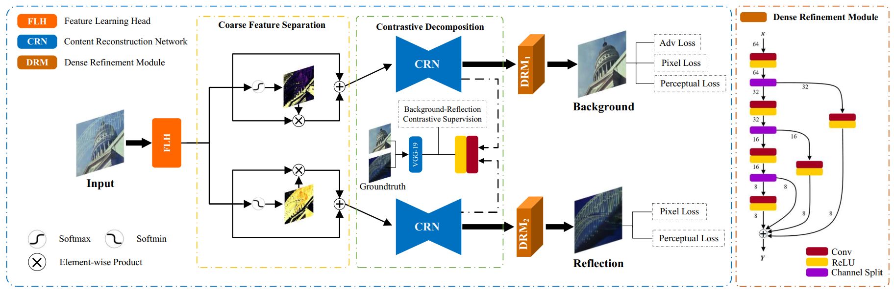

# CONTRASTIVE FEATURE DECOMPOSITION FOR IMAGE REFLECTION REMOVAL  

Code for ICME2021(oral) paper: Contrastive Feature Decomposition for Image Reflection Removal.

## NetWork Architecture



​                          **The overall framework of our proposed contrastive feature decomposition method for image reflection removal.**

## Installation

The model is built in PyTorch 1.2.0 and tested on Ubuntu 16.04 environment (Python3.7, CUDA9.0, cuDNN7.5).

You can installation the environment via the following:

```
pip install -r requirements.txt
```

## DataSet

- Training dataset: synthetic and real dataset from [PLNet](https://drive.google.com/drive/folders/1NYGL3wQ2pRkwfLMcV2zxXDV8JRSoVxwA).

- Test dataset: test sets of  [$\rm SIR^2$](http://rose1.ntu.edu.sg/Datasets/sir2Benchmark.asp) (divided into three datasets: Solid, Wild, Postcard) and [Real20](https://github.com/ceciliavision/perceptual-reflection-removal).

## Training

Please have yours real and synthetic data paths set up correctly according to option.py.

```
CUDA_VISIBLE_DEVICES=0,1 python -m torch.distributed.launch --nproc_per_node=2 train.py
```

## Test

Please have yours test data paths set up correctly according to option.py.

Download the pre-trained model [here](https://drive.google.com/drive/folders/1qe9PMOXtFHygm6_lwayHQc9HFYiq4u9h?usp=sharing).

```
python test.py
```

## Citation

If you find this work useful for your research, please cite:

```
@inproceedings{Feng2021CFDNet,
    title={Contrastive Feature Decomposition for Image Reflection Removal},
    author={Xin Feng, Haobo Ji, Bo Jiang, Wenjie Pei, Fanglin Chen, and Guangming Lu},
    booktitle={IEEE International Conference on Multimedia and Expo (ICME)},
    year={2021}
}
```

